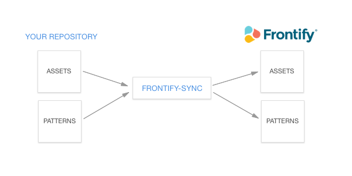

frontify-sync
===================

This package provides automatic synchronisation between local patterns and assets folders to a Frontify project.




## Installation
---------------

Installing globally will give you access to the `frontify-sync` command anywhere on your system:  

```
npm install -g frontify-sync
```

You can also add `frontify-sync` to your `package.json` file:  

```
npm install frontify-sync --save-dev
```

## Options
------------------

`frontify-sync` comes with a few **options**.    
It's possible to sync only `assets` or `patterns`, but at least one of these options must be set.  

|Option  | Type | Command | Optional | Notes |
:------------- | :------------------------- | :------------------------- | :-----------| :-----------|
| configuration  | String | -c, --configuration | true | Set configuration file source path
| projectId | String | -P, --project-id | false | Set project id |
| accessToken | String | -A, --access-token | false | Set access token |
| patterns  | String | -p, --patterns | false if missing `assets` | Set patterns directory source path |
| assets | Array of glob &#124; glob | -a, --assets | false if missing `patterns` | Set assets directory source path |
| cwd | String  | -C, --cwd | true | Set the current working directory for local assets |
| target | String  | -T, --target | true | Set the target directory for assets in Frontify project |
| dryRun | Boolean | -D, --dry-run | true | Run a fake synchronisation to check for updated items |

## Usage
------------------

#### As a module
------------------

Just require the package and pass options to the function:  

```
var sync = require('frontify-sync');
var options = {
  accessToken: "your_frontify_access_token",
  projectId: "your_frontify_project_id",
  patterns: "./patterns",
  assets: "./assets/**/*.*"
}

sync(options);
```

Additionally, you can use a configuration file that can contains all possible options (except `configuration` of course). Please note that options in configuration file will always be overwritten by regular options.  

```
#configuration.json
{
  "accessToken": "your_frontify_access_token",
  "projectId": "your_frontify_project_id",
  "patterns": "./patterns",
  "assets": "./assets/**/*.*",
}
```
```
var sync = require('frontify-sync');
var options = {
  configuration: "./configuration.json"
}

sync(options);
```

#### From command line interface
------------------

```
$ frontify-sync -A "your_frontify_access_token" -P "your_frontify_project_id" -p "./patterns" -a "./assets/**/*.*"
```

As well, you can set only a configuration file path:  

```
$ frontify-sync -c "./configuration.json"
```

## Contributing
------------------

You can develop and test locally your modified package by running `npm link`. The package becomes then globally accessible.

Commit messages must follow conventions, please use these guidelines: https://github.com/conventional-changelog/conventional-changelog-angular/blob/master/convention.md 

Any new feature must be unit tested. The following `npm` tasks are available:

  - `npm test` Will run all tests and print tests results along code coverage.
  - `npm run test-ci` Will watch for any files changes and run all tests

Code coverage report is generated in `/coverage/lcov-report` folder

## Release process
------------------
Release is made with `standard-version` of `conventional-changelog`:

```
npm run release
```

The following jobs will be ran:

  - Bumping version in package.json file 
  - Outputting changes to CHANGELOG.md (based on commit messages) 
  - Committing package.json and CHANGELOG.md 
  - Adding a new tag for targeted release 


Once your local master branch is ready, just run the following command:
```
npm run publish
```

The following jobs will be ran:

  - Pushing commit and tag to the remote master branch
  - Publish the package to npm registry

> Publishing on npm registry requires a registered user. Please read [Publishing npm packages](https://docs.npmjs.com/getting-started/publishing-npm-packages) for more details.